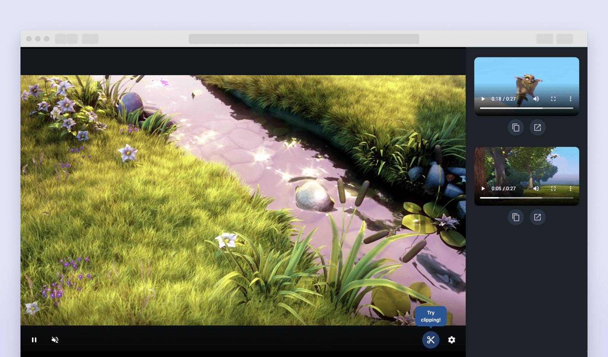

# Amazon IVS Clip web demo

A demo web application intended as an educational tool for demonstrating how you can implement a stream "clipping" functionality with [Amazon IVS](https://aws.amazon.com/ivs/), store those clips on [Amazon S3](https://aws.amazon.com/s3/) and serve them with [Amazon CloudFront](https://aws.amazon.com/cloudfront/).
This demo uses [AWS Cloud Development Kit](https://aws.amazon.com/cdk/) (AWS CDK).

**This project is intended for education purposes only and not for production usage.**

## Prerequisites
- AWS CLI ( [Installing the AWS CLI version 2](https://docs.aws.amazon.com/cli/latest/userguide/install-cliv2.html) )
- Go ( [Download and install](https://golang.org/doc/install) )
- NodeJS ( [Installing Node.js](https://nodejs.org/) )

## To use and deploy this project
***IMPORTANT NOTE:** this demo will create and use AWS resources on your AWS account, which will cost money.*

1. In the `cdk` directory, run:
`npm install`

2. then run:
`make bootstrap`

3. and finally:
`make deploy`

### Final steps

The script will give you 3 important pieces of information:
1. `ClipsUI.ingestserver`, the ingest server address to use in your broadcasting software ( [learn how to stream to Amazon IVS](https://aws.amazon.com/blogs/media/setting-up-for-streaming-with-amazon-ivs/) )
2. `ClipsUI.streamkey`, the stream key for your newly created Amazon IVS channel
3. `ClipsUI.url`, the hosted frontend URL

Once you go live, you will be able to see your live video stream on the hosted frontend, and you will be able to start creating clips.

## About Amazon IVS
Amazon Interactive Video Service (Amazon IVS) is a managed live streaming solution that is quick and easy to set up, and ideal for creating interactive video experiences. [Learn more](https://aws.amazon.com/ivs/).

* [Amazon IVS docs](https://docs.aws.amazon.com/ivs/)
* [User Guide](https://docs.aws.amazon.com/ivs/latest/userguide/)
* [API Reference](https://docs.aws.amazon.com/ivs/latest/APIReference/)
* [Setting Up for Streaming with Amazon Interactive Video Service](https://aws.amazon.com/blogs/media/setting-up-for-streaming-with-amazon-ivs/)

## Security

See [CONTRIBUTING](CONTRIBUTING.md#security-issue-notifications) for more information.

## License

This library is licensed under the MIT-0 License. See the LICENSE file.